# 📊 Financial Performance Dashboard

End-to-end Data Analytics project that transforms financial actuals and budget data into actionable business insights using **SQL**, **Python**, and **Power BI**.

---

## 📌 Project Overview

This project analyzes company financial records (2022–2025) to answer key business questions related to revenue, expenses, net profit, profit margin, budget vs actual performance, department spending, and yearly trends.

The complete pipeline follows a real-world data analyst workflow:

**SQL → Python (Pandas + Matplotlib) → Power BI Dashboard**

---

## 🛠️ Tools & Technologies

- **SQL (MySQL)** – Data extraction and financial analysis
- **Python** – Data cleaning, exploratory data analysis (EDA), and visualization
- **Pandas & NumPy** – Data manipulation
- **Matplotlib & Seaborn** – Charts and visual insights
- **Power BI** – Interactive Financial Performance Dashboard
- **Git & GitHub** – Version control and project showcase

---

## ✨ Key Features

- Overall KPIs (Total Revenue, Total Expenses, Net Profit, Profit Margin %)
- Monthly P&L trend (Revenue vs Expenses vs Profit)
- Revenue analysis by category
- Expense analysis by category and department
- Budget vs Actual variance analysis
- Yearly comparison and performance view
- Interactive Power BI Dashboard with multiple pages

---

## 📈 Key Insights

- Overall profit margin is positive across the analysis period
- Revenue and expenses show clear monthly patterns
- Certain expense categories and departments drive most costs
- Budget vs actual gaps highlight areas for cost control
- Yearly profit varies with growth and cost management
- Some months show losses while the overall period remains profitable

---

## 📁 Project Structure

```
Financial-Performance-Dashboard/
├── data/
│   ├── financial_data.csv
│   ├── monthly_summary.csv
│   └── summaries/
├── sql/
│   ├── 01_schema_and_load.sql
│   └── 02_analysis_queries.sql
├── python/
│   ├── 01_financial_analysis.py
│   └── charts/
├── powerbi/
│   └── Financial_Performance_Dashboard.pbix
├── docs/
│   └── PowerBI_Dashboard_Guide.md
├── images/
│   ├── sql/
│   ├── python/
│   └── powerbi/
├── requirements.txt
└── README.md
```

---

## 🚀 How to Run the Project

### 1. SQL Analysis (MySQL)
- Create the database and table using `sql/01_schema_and_load.sql`
- Import `data/financial_data.csv`
- Run the analysis queries from `sql/02_analysis_queries.sql`

### 2. Python Analysis
```bash
pip install -r requirements.txt
python python/01_financial_analysis.py
```

### 3. Power BI Dashboard
- Open `powerbi/Financial_Performance_Dashboard.pbix` in Power BI Desktop
- Or follow the step-by-step guide in `docs/PowerBI_Dashboard_Guide.md`

---

## 📊 Dashboard Pages (Power BI)

1. **Executive Overview** – KPIs, monthly revenue/expenses/profit  
2. **Revenue Analysis** – By category and trends  
3. **Expense Analysis** – By category and department  
4. **Budget vs Actual** – Variances and recommendations  

---

## 🖼️ Screenshots

### Power BI Dashboard
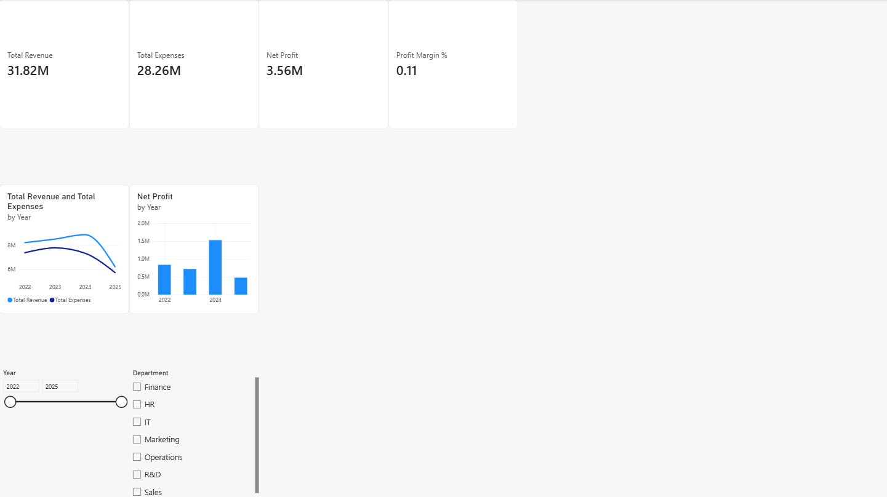
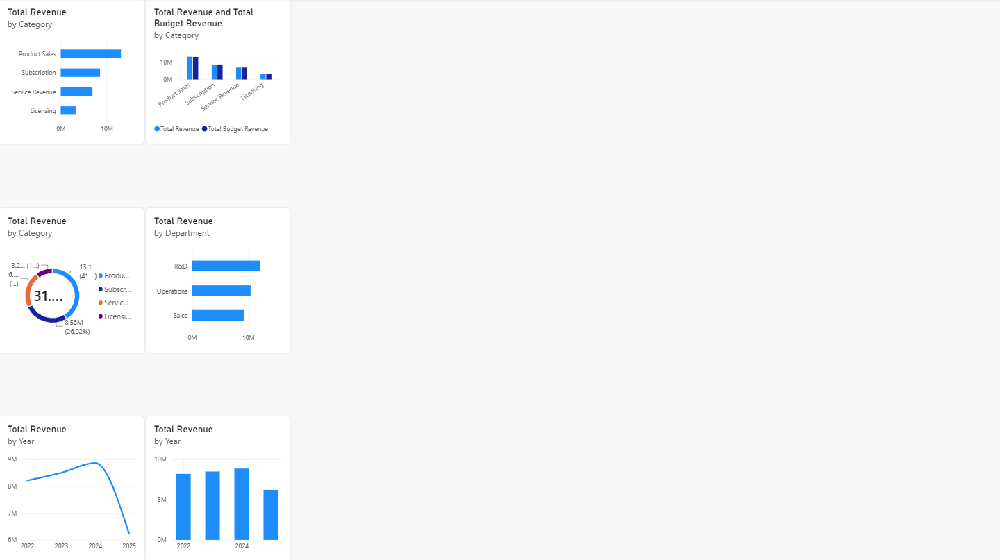
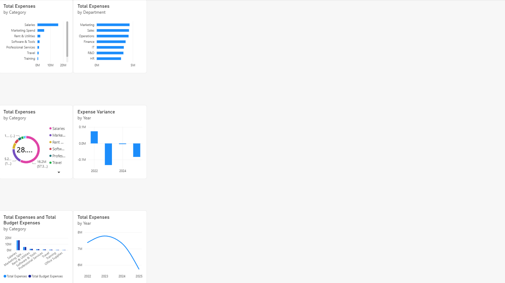
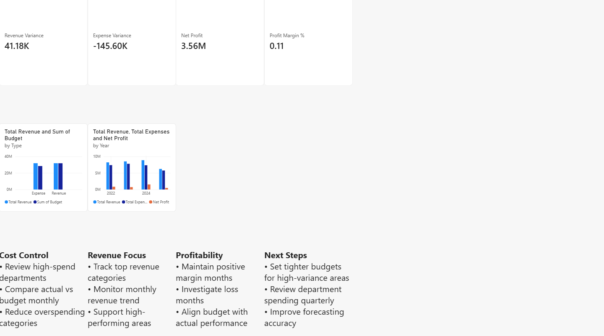

### SQL Analysis

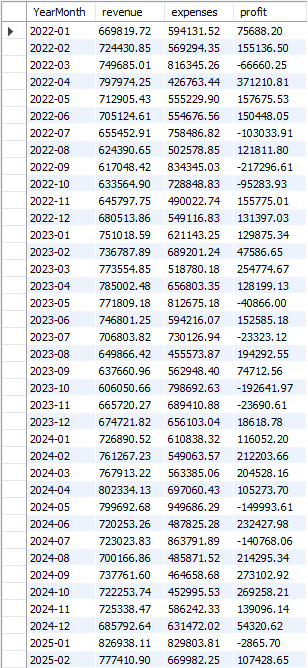
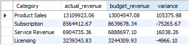
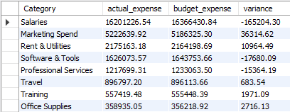
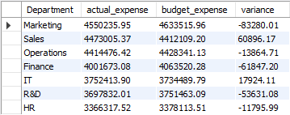
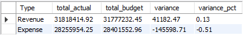

### Python Visualizations
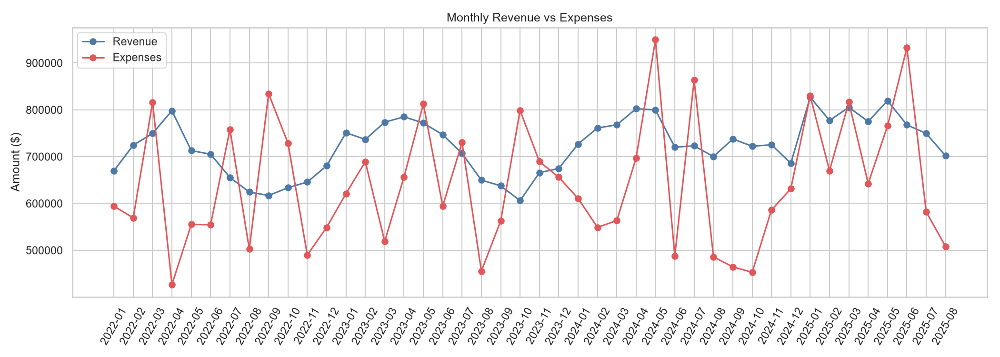
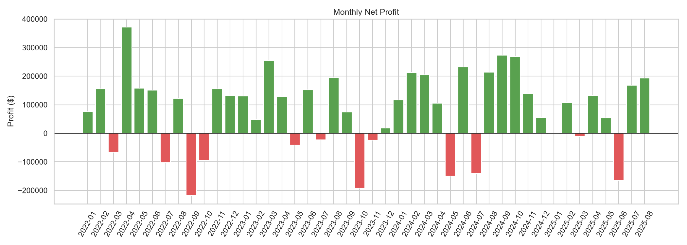
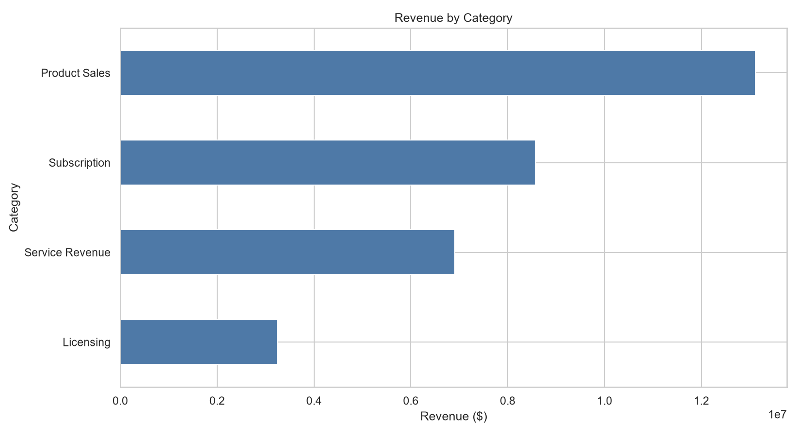
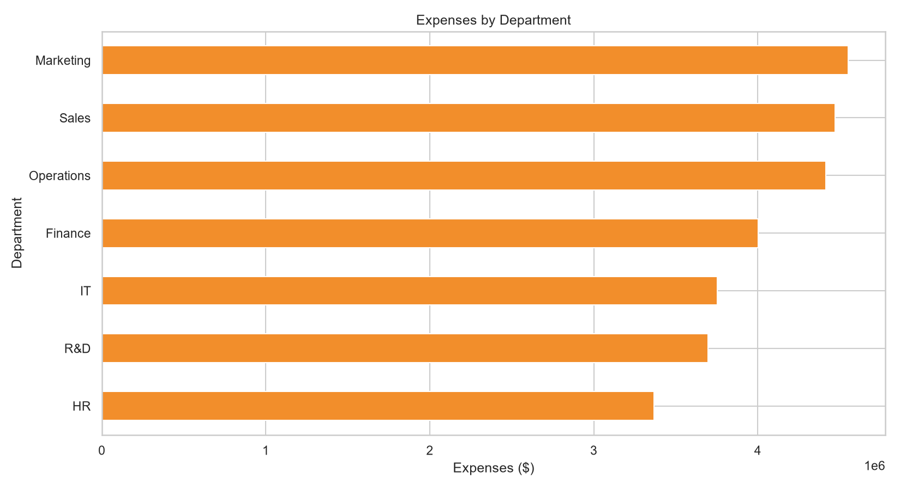
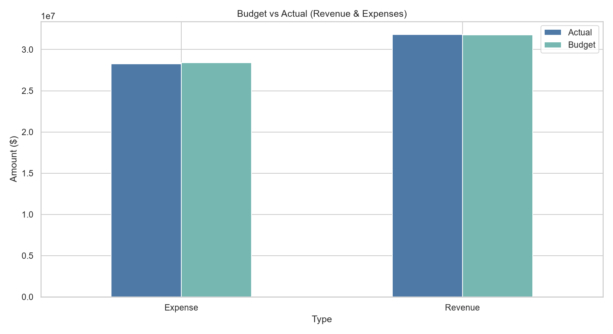
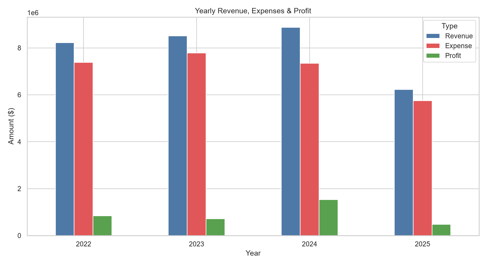

---

## 👤 Author

**Mubeen Salman**  
Aspiring Data Analyst  

- LinkedIn: [https://www.linkedin.com/in/mubeen-salman-459776364/]  
- GitHub: [https://github.com/MuhammadMubeen04]  

---

## 📄 License

This project is for educational and portfolio purposes.
